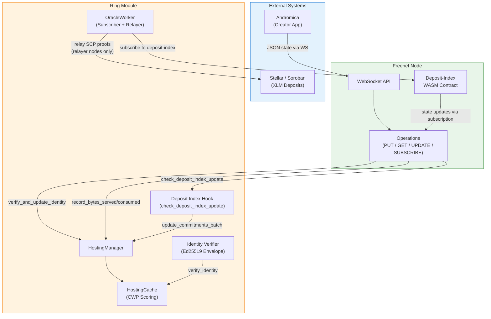
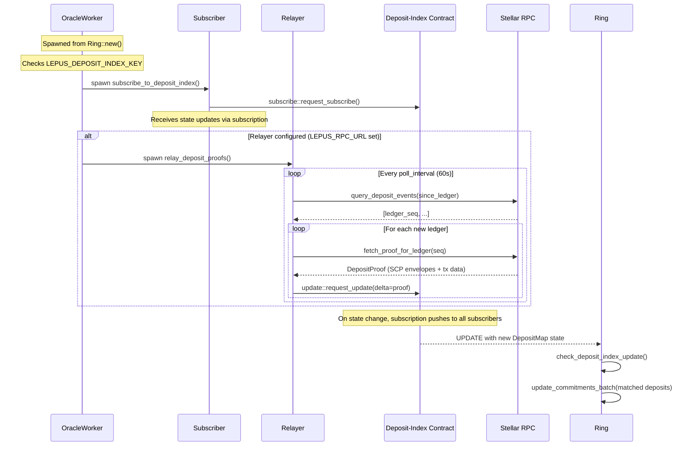

# Lepus: Commitment-Weighted Persistence

## Overview

Lepus replaces Freenet's default LRU cache eviction with **Commitment-Weighted Persistence (CWP)** — a scoring system that prioritizes contracts backed by economic commitment, verified identity, and network contribution. Contracts with higher CWP scores survive eviction longer.

Lepus is gated behind the `lepus` Cargo feature flag. When disabled, the hosting cache uses standard LRU eviction with no behavioral change.

## Problem: LRU Cannot Protect Bespoke Content

Default LRU eviction treats all contracts equally. A spam contract accessed frequently will evict a valuable datapod that hasn't been accessed recently. Content creators have no way to signal that their content matters or to invest in its persistence.

CWP solves this by scoring contracts on four dimensions: economic commitment (XLM deposits on Stellar), identity verification (Ed25519 envelope), network contribution (bytes served vs. consumed), and recency of access.

## Architecture



## CWP Scoring Formula

```
score = w_c * commitment + w_i * identity + w_n * contribution + w_r * recency
```

The score is clamped to [0.0, 1.0]. Higher scores survive eviction longer.

**Code reference:** `crates/core/src/ring/hosting/cache.rs:166-178`

### Sub-Score Details

| Sub-Score | Formula | Range | What It Rewards |
|-----------|---------|-------|-----------------|
| **Commitment** | `min(1.0, deposited_xlm / (size_bytes * density_target))` | [0, 1] | XLM deposit relative to contract size |
| **Identity** | `creator_verified * 0.6 + subscriber_verified * 0.4` | [0, 1] | Valid Ed25519 identity envelope |
| **Contribution** | `min(1.0, (bytes_served / max(bytes_consumed, 1)) / target)` | [0, 1] | Contracts that serve more data than they consume |
| **Recency** | `1.0 / (1.0 + elapsed_secs / halflife_secs)` | (0, 1] | Recent access; decays with half-life |

**Code references:**
- Commitment: `cache.rs:180-189`
- Identity: `cache.rs:191-206`
- Contribution: `cache.rs:208-215`
- Recency: `cache.rs:217-226`

### Scoring Weights

| Weight | Default | Description |
|--------|---------|-------------|
| `commitment_weight` | 0.50 | Economic commitment (dominant signal) |
| `identity_weight` | 0.25 | Verified creator/subscriber identity |
| `contribution_weight` | 0.15 | Network contribution ratio |
| `recency_weight` | 0.10 | Recency of last access |

**Code reference:** `crates/core/src/ring/hosting/cache.rs:67-79`

### Worked Example

**Datapod with 10 XLM deposit (2 KB, creator+subscriber verified, active):**

| Sub-Score | Calculation | Value |
|-----------|-------------|-------|
| Commitment | `min(1.0, 10 / (2048 * 0.001))` = `min(1.0, 4.88)` | 1.0 |
| Identity | `0.6 + 0.4` | 1.0 |
| Contribution | `min(1.0, (5000 / 2000) / 1.5)` = `min(1.0, 1.67)` | 1.0 |
| Recency | `1.0 / (1.0 + 3600 / 604800)` | 0.994 |
| **Total** | `0.50*1.0 + 0.25*1.0 + 0.15*1.0 + 0.10*0.994` | **0.999** |

**Spam contract (no deposit, no identity, recently accessed):**

| Sub-Score | Calculation | Value |
|-----------|-------------|-------|
| Commitment | No deposit | 0.0 |
| Identity | No identity | 0.0 |
| Contribution | `min(1.0, (100 / 5000) / 1.5)` | 0.013 |
| Recency | `1.0 / (1.0 + 300 / 604800)` | 0.9995 |
| **Total** | `0.50*0.0 + 0.25*0.0 + 0.15*0.013 + 0.10*0.9995` | **0.102** |

The datapod scores ~10x higher than spam, surviving eviction far longer.

## Eviction Behavior

### Without Lepus (LRU)

Standard eviction: when the byte budget is exceeded, the oldest-accessed contract past `min_ttl` is evicted. No priority scoring.

**Code reference:** `crates/core/src/ring/hosting/cache.rs:336-361`

### With Lepus (CWP)

Score-based eviction: when the byte budget is exceeded, the contract with the **lowest CWP persistence score** among those past `min_ttl` is evicted. An O(n) scan finds the victim — acceptable for the ~50K contract limit.

If all remaining contracts are within `min_ttl`, the cache temporarily exceeds its budget rather than evicting protected contracts.

**Code reference:** `crates/core/src/ring/hosting/cache.rs:363-383`

## Data Flow

### PUT / UPDATE Path (Identity Verification)

When a PUT or UPDATE delivers contract state to a node:

1. Operation stores the contract state
2. `Ring::verify_and_update_identity()` is called with the state bytes
3. `identity::verify_identity()` parses the 129-byte identity envelope
4. Ed25519 signature is verified over `recipient_pubkey || payload`
5. `HostingCache::update_identity()` records creator/subscriber verification flags
6. Identity sub-score becomes non-zero (up to 1.0)

**Code references:**
- PUT hook (regular): `crates/core/src/operations/put.rs:367-373`
- PUT hook (streaming): `crates/core/src/operations/put.rs:908-914`
- UPDATE hook: `crates/core/src/operations/update.rs:1213-1219`
- Verification: `crates/core/src/ring/hosting/identity.rs:143-178`

### GET Path (Contribution Tracking)

When a GET operation serves or receives contract state:

1. **Serving:** `Ring::record_bytes_served()` increments the contract's `bytes_served` counter
2. **Receiving:** `Ring::record_bytes_consumed()` increments the contract's `bytes_consumed` counter
3. Contribution sub-score reflects the ratio `bytes_served / bytes_consumed`

**Code references:**
- Bytes served: `crates/core/src/operations/get.rs:965-970`
- Bytes consumed: `crates/core/src/operations/get.rs:1696-1700`

### Deposit-Index Subscription (Commitment Updates)

Commitment scores are fed by subscribing to the **deposit-index Freenet contract** — a WASM contract that maintains a verified map of XLM deposits per Freenet contract. This replaces the original direct Soroban polling design.

The `OracleWorker` runs as a background task with two modes:



**Subscriber path (all lepus nodes):** Subscribes to the deposit-index contract. When the contract state updates, `check_deposit_index_update()` matches deposit entries to locally hosted contracts and feeds amounts into CWP commitment scores.

**Relayer path (nodes with Stellar RPC access):** Polls Stellar for new ledgers with DEPOSIT events, fetches SCP proof bundles, and submits them as UPDATE deltas to the deposit-index contract. The deposit-index WASM contract verifies the SCP proofs before accepting the update.

**Code references:**
- Subscriber hook: `crates/core/src/ring/hosting/deposit_index.rs`
- Oracle worker: `crates/core/src/ring/hosting/oracle.rs`
- UPDATE hook: `crates/core/src/operations/update.rs:1213-1222`

### Subscription Handshake (Subscriber Identity)

During SUBSCRIBE, the subscriber proves key ownership:

1. Subscriber signs the `ContractInstanceId` with their Stellar Ed25519 key
2. `StellarIdentityPayload` (pubkey + signature) is sent with the subscribe message
3. Host verifies the Ed25519 signature over the instance ID bytes
4. `Ring::update_subscriber_identity()` records the verified subscriber pubkey
5. Subscriber verification contributes 0.4 to the identity sub-score

**Code references:**
- Payload construction: `crates/core/src/operations/subscribe.rs:71-89`
- Verification: `crates/core/src/operations/subscribe.rs:690-733`

## Configuration

### Environment Variables

| Variable | Required By | Purpose | Example |
|----------|-------------|---------|---------|
| `LEPUS_DEPOSIT_INDEX_KEY` | All lepus nodes | Hex 32-byte deposit-index `ContractInstanceId` | `a1b2c3...` (64 hex chars) |
| `LEPUS_DEPOSIT_INDEX_CODE_HASH` | Relayer nodes | Hex 32-byte deposit-index `CodeHash` | `d4e5f6...` (64 hex chars) |
| `LEPUS_RPC_URL` | Relayer nodes | Stellar RPC endpoint for fetching SCP proofs | `https://horizon-testnet.stellar.org` |
| `LEPUS_POLL_INTERVAL_SECS` | Relayer nodes | Relayer poll interval (seconds) | `60` |
| `LEPUS_STELLAR_PUBKEY` | Identity verification | Node's Ed25519 public key (hex, 32 bytes) | `a1b2c3...` (64 hex chars) |
| `LEPUS_STELLAR_SECRET` | Transport key derivation | Node's Ed25519 secret key (hex, 32 bytes) | `d4e5f6...` (64 hex chars) |

**Node roles:**
- **Subscriber** (all lepus nodes): Set `LEPUS_DEPOSIT_INDEX_KEY`. The node subscribes to the deposit-index contract and receives commitment updates automatically.
- **Relayer** (nodes with Stellar access): Also set `LEPUS_RPC_URL` and `LEPUS_DEPOSIT_INDEX_CODE_HASH`. The node fetches SCP proofs from Stellar and submits them to the deposit-index contract.

### Feature Flag

```toml
# crates/core/Cargo.toml
[features]
lepus = ["ordered-float", "ed25519-dalek"]
```

All CWP code is behind `#[cfg(feature = "lepus")]`. When disabled, the crate compiles and behaves exactly as upstream Freenet.

### CWP Tuning Parameters

| Parameter | Default | Description |
|-----------|---------|-------------|
| `commitment_density_target` | 0.001 | XLM per byte at which commitment saturates to 1.0 |
| `contribution_target` | 1.5 | Served/consumed ratio at which contribution saturates |
| `recency_halflife_secs` | 604,800 (7 days) | Time for recency score to decay to 0.5 |

**Code reference:** `crates/core/src/ring/hosting/cache.rs:49-64`

## Source Files

| File | Purpose |
|------|---------|
| `crates/core/src/ring/hosting/cache.rs` | CWP structs, scoring, eviction |
| `crates/core/src/ring/hosting/oracle.rs` | Dual-mode oracle (subscriber + relayer) |
| `crates/core/src/ring/hosting/deposit_index.rs` | Deposit-index types, config, subscriber hook |
| `crates/core/src/ring/hosting/identity.rs` | Identity envelope verification |
| `crates/core/src/ring/hosting.rs` | HostingManager delegation layer |
| `crates/core/src/ring/mod.rs` | Ring-level CWP method delegation |
| `crates/core/src/operations/get.rs` | Contribution tracking (bytes served/consumed) |
| `crates/core/src/operations/put.rs` | Identity verification hooks |
| `crates/core/src/operations/update.rs` | Identity + deposit-index hooks |
| `crates/core/src/operations/subscribe.rs` | Subscriber identity handshake |
| `crates/core/src/config/secret.rs` | Stellar key derivation for transport |
| `crates/core/src/transport/crypto.rs` | Ed25519 to X25519 key conversion |
| `contracts/hvym-freenet-service/` | Soroban contract for XLM deposits (Phase A) |
| `contracts/deposit-index/` | Freenet WASM contract for SCP-verified deposits (Phase B) |
| `contracts/datapod/` | WASM contract for identity envelopes |

## Implementation Phases

| Phase | Description | Status |
|-------|-------------|--------|
| 1 | CWP cache scoring and eviction | Complete |
| 2 | Soroban commitment oracle and persistence deposits | Complete (superseded by Phase C) |
| 3 | Identity envelope verification and subscriber matching | Complete |
| 4 | Datapod validation, subscription identity, transport key derivation | Complete |
| 5 | JSON encoding protocol, datapod contract, Lepus CI | Complete |
| A | Event-based Soroban contract with burn+treasury model | Complete |
| B | Deposit-index WASM contract with SCP proof verification | Complete |
| C | Node-side integration: deposit-index subscriber + Stellar proof relayer | Complete |

**Phase evolution:** The original Phase 2 (direct Soroban RPC polling) was replaced by Phases A/B/C. Instead of each node polling Soroban directly, a WASM contract on the Freenet network itself maintains a verified deposit map. Nodes subscribe to this contract for updates, and relayer nodes bridge data from Stellar via SCP proofs. This reduces Stellar RPC load and leverages Freenet's existing subscription infrastructure.

## Related Documentation

- [Stellar Contract](stellar-contract.md) — Soroban deposit contract (`hvym-freenet-service`)
- [Deposit-Index Contract](deposit-index-contract.md) — Freenet WASM contract for SCP-verified deposits
- [Datapod Contract](datapod-contract.md) — WASM identity validator
- [Ring Architecture](../ring/README.md) — DHT topology and hosting
- [Operations](../operations/README.md) — Operation state machines
