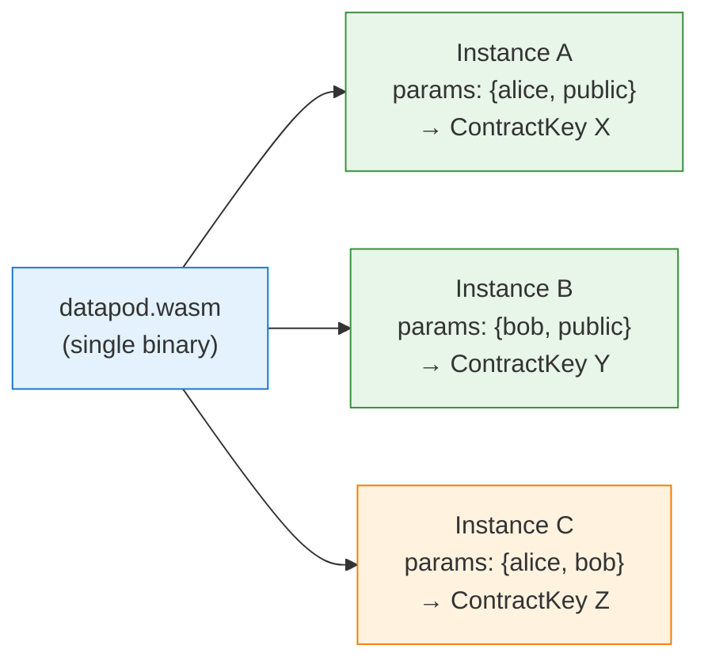

# Datapod Contract: Freenet WASM Identity Validator

## Overview

The datapod contract is a Freenet WASM contract that enforces identity envelopes on contract state. It validates that state carries a correct Ed25519 signature from the creator, binding the creator's identity to the content.

One compiled WASM binary serves all datapod instances. Each instance has different `DatapodParams` (creator + recipient public keys), producing a different `ContractKey`. This "one WASM, many instances" pattern means a single deployment covers all users.

- **Runtime:** Freenet WASM (`freenet-stdlib`)
- **Cryptography:** Ed25519 (via `ed25519-dalek`)
- **Typical state size:** ~2 KB (129-byte header + NINJS JSON payload)

## Contract Interface

### validate_state

Validates that the state carries a well-formed identity envelope:

1. Empty state is valid (allows initial creation)
2. Check minimum size (129 bytes for envelope header)
3. Parse `DatapodParams` from contract parameters (JSON)
4. Verify version byte is `0x01`
5. Extract `creator_pubkey` (bytes 1-32) and verify it matches `params.creator_pubkey`
6. Extract `recipient_pubkey` (bytes 97-128) and verify it matches `params.recipient_pubkey`
7. Construct message: `recipient_pubkey || payload`
8. Verify Ed25519 signature (bytes 33-96) over that message using `creator_pubkey`

Returns `ValidateResult::Valid` if all checks pass, `ValidateResult::Invalid` otherwise.

**Code reference:** `contracts/datapod/src/lib.rs:43-109`

### update_state

Iterates through `UpdateData` entries and accepts the first one that passes `validate_state`. This implements a last-write-wins merge strategy — the newest valid state replaces the old state.

Returns `ContractError::InvalidUpdate` if no valid update is found.

**Code reference:** `contracts/datapod/src/lib.rs:111-136`

### summarize_state

Returns the full state as the summary. Datapods are small (~2 KB), so there is no benefit to a compressed summary.

**Code reference:** `contracts/datapod/src/lib.rs:138-147`

### get_state_delta

Returns the full state as the delta if the summary differs from current state. Returns an empty delta if they match. Again, datapods are small enough that full-state transfer is efficient.

**Code reference:** `contracts/datapod/src/lib.rs:149-160`

## Identity Envelope Format

### Binary Layout

| Offset | Size | Field | Description |
|--------|------|-------|-------------|
| 0 | 1 | `version` | Protocol version (`0x01`) |
| 1 | 32 | `creator_pubkey` | Creator's Ed25519 public key |
| 33 | 64 | `creator_signature` | Ed25519 signature |
| 97 | 32 | `recipient_pubkey` | Intended recipient's Ed25519 public key |
| 129 | variable | `payload` | Contract state (NINJS JSON) |

Total header size: **129 bytes**.

**Code reference:** `contracts/datapod/src/lib.rs:18-24`, `crates/core/src/ring/hosting/identity.rs:6-20`

### Signature Scheme

The signature covers the concatenation of `recipient_pubkey` and the state payload:

```
message = recipient_pubkey (32 bytes) || payload (variable)
signature = Ed25519.sign(creator_secret_key, message)
```

This binds the content both to the creator (via the signing key) and to the intended recipient (included in the signed message). The creator cannot be impersonated, and the content cannot be re-targeted to a different recipient without invalidating the signature.

### Public vs. Private Content

| Recipient | Meaning |
|-----------|---------|
| `[0u8; 32]` (all zeros) | Public content — any node can host and serve it |
| Specific public key | Private content — only the matching subscriber should receive it |

The all-zeros recipient is defined as `PUBLIC_RECIPIENT` in the node-side identity verifier.

**Code reference:** `crates/core/src/ring/hosting/identity.rs` (PUBLIC_RECIPIENT constant)

## Parameters Model

### DatapodParams

```json
{
  "creator_pubkey": "a1b2c3d4...64 hex chars...",
  "recipient_pubkey": "00000000...64 hex chars..."
}
```

Parameters are baked into the `ContractKey` at creation time and cannot change for the life of the contract. The same WASM code hash with different parameters produces a different `ContractKey`.

**Code reference:** `contracts/datapod/src/lib.rs:10-16`

### One WASM, Many Instances



- **Instance A:** Alice's public datapod (anyone can host/view)
- **Instance B:** Bob's public datapod
- **Instance C:** Alice's private datapod for Bob (only Bob's node should serve it)

The `ContractKey` is derived from `hash(code_hash, params)`, so identical code with different params yields different keys.

## Node-Side Verification

The datapod contract validates state inside the WASM sandbox. Additionally, the Freenet node performs identity verification outside the sandbox for CWP scoring purposes.

### PUT / UPDATE Hooks

When a PUT or UPDATE delivers contract state to the node:

```
Operations layer
  → Ring::verify_and_update_identity(key, state_bytes)
    → HostingManager::verify_and_update_identity()
      → identity::verify_identity(state_bytes)
        → Parse 129-byte envelope
        → Verify Ed25519 signature
        → Check if node is valid subscriber
      → HostingCache::update_identity(key, flags)
        → Updates creator_verified, subscriber_verified
        → Identity sub-score becomes non-zero
```

**Code references:**
- PUT regular: `crates/core/src/operations/put.rs:367-373`
- PUT streaming: `crates/core/src/operations/put.rs:908-914`
- UPDATE: `crates/core/src/operations/update.rs:1213-1219`
- verify_identity: `crates/core/src/ring/hosting/identity.rs:143-178`
- HostingManager delegation: `crates/core/src/ring/hosting.rs:589-598`

### Subscription Identity Verification

During the SUBSCRIBE handshake, the subscriber proves ownership of their Stellar key:

1. Subscriber reads `LEPUS_STELLAR_SECRET` and derives an Ed25519 signing key
2. Signs the `ContractInstanceId` bytes to produce a `StellarIdentityPayload`
3. Payload (pubkey + signature) is included in the `SubscribeMsg`
4. Host verifies the signature over the instance ID
5. On success, calls `Ring::update_subscriber_identity()` to record the verified pubkey
6. Subscriber verification contributes 0.4 to the identity sub-score

**Code references:**
- Payload struct: `crates/core/src/operations/subscribe.rs:36-43`
- Payload construction: `crates/core/src/operations/subscribe.rs:71-89`
- Host-side verification: `crates/core/src/operations/subscribe.rs:690-733`

### Transport Key Derivation

Nodes can optionally derive their transport X25519 keypair from their Stellar Ed25519 secret key. This links the node's network identity to its Stellar identity.

**Derivation:**
1. Read `LEPUS_STELLAR_SECRET` env var (32 bytes, hex-encoded)
2. SHA-512 hash the Ed25519 secret key
3. Take the first 32 bytes and apply X25519 clamping (RFC 7748)
4. Use as the X25519 static secret for transport encryption

If `LEPUS_STELLAR_SECRET` is not set, the node falls back to a random transport keypair.

**Code references:**
- Entry point: `crates/core/src/config/secret.rs:204-222`
- X25519 conversion: `crates/core/src/transport/crypto.rs:92-108`

## Source Files

| File | Purpose |
|------|---------|
| `contracts/datapod/src/lib.rs` | WASM contract (validate, update, summarize, delta) |
| `contracts/datapod/Cargo.toml` | Contract crate dependencies |
| `crates/core/src/ring/hosting/identity.rs` | Node-side identity envelope verifier |
| `crates/core/src/operations/subscribe.rs` | Subscriber identity handshake |
| `crates/core/src/config/secret.rs` | Stellar key derivation |
| `crates/core/src/transport/crypto.rs` | Ed25519 to X25519 key conversion |

## Related Documentation

- [Lepus Overview](README.md) — CWP scoring and architecture
- [Stellar Contract](stellar-contract.md) — Soroban deposit contract
