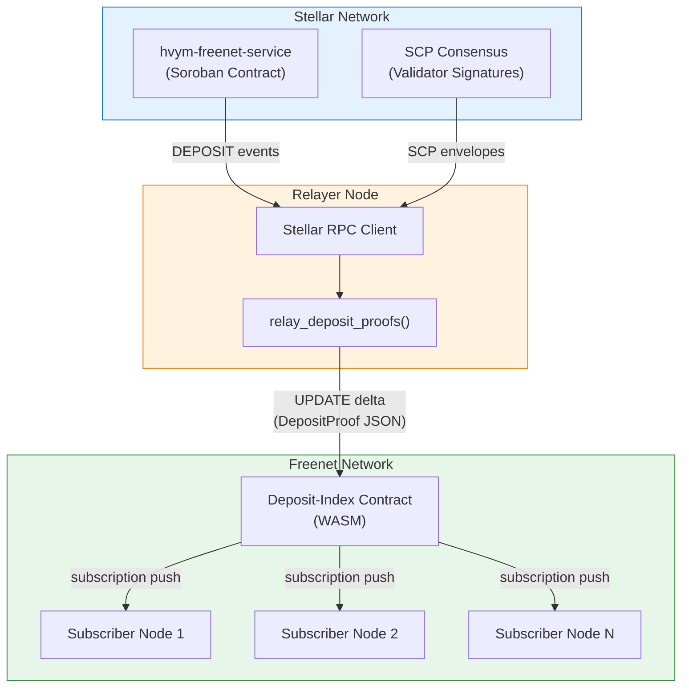

# Deposit-Index Contract: SCP-Verified Deposit Bridge

## Overview

The deposit-index contract is a **Freenet WASM contract** that maintains a verified map of XLM deposits per Freenet contract. It bridges deposit data from Stellar to the Freenet network by accepting SCP proof bundles as UPDATE deltas and verifying them cryptographically before updating its state.

This contract replaces the original design where each node polled Soroban directly. Instead, relayer nodes submit proofs to this single contract, and all other nodes receive updates via Freenet's native subscription mechanism.

- **Runtime:** Freenet WASM (`freenet-stdlib`)
- **Verification:** SCP consensus proofs with Ed25519 signature verification
- **Dependencies:** `stellar-xdr` v24.0.1, `ed25519-dalek` v2, `sha2`
- **WASM size:** ~367 KB (well under 1 MB limit)

## Architecture



## Contract Interface

### validate_state

Validates that the state is a well-formed `DepositMap` JSON:

1. Empty state is valid (initial creation)
2. Deserialize as `DepositMap`
3. Verify version field is present
4. Verify all deposit entries have valid hex contract IDs (64 hex chars)

**Code reference:** `contracts/deposit-index/src/lib.rs`

### update_state (5-Stage Pipeline)

The core verification pipeline for incoming SCP proofs:

```
Stage 1: Parse delta as DepositProof JSON
Stage 2: Decode SCP envelopes from base64 XDR
Stage 3: Verify Ed25519 signatures on SCP statements
Stage 4: Check quorum (per-org majority + org threshold)
Stage 5: Extract DEPOSIT events from transaction results
         Merge into existing DepositMap (cumulative, idempotent)
```

Each stage can independently reject invalid proofs. The contract only updates its state if all stages pass.

**Code reference:** `contracts/deposit-index/src/lib.rs`

### summarize_state / get_state_delta

Full-state transfer for both (deposit maps are typically small). Summarize returns the full state; delta returns the full state if different from the provided summary.

## Data Model

### DepositMap (Contract State)

```json
{
  "version": 1,
  "last_ledger_seq": 12345,
  "deposits": [
    {
      "contract_id": "a1b2c3...64 hex chars...",
      "total_deposited": 50000000,
      "last_ledger": 12345
    }
  ]
}
```

Deposits are **cumulative** (amounts from new ledgers are added to existing totals) and **idempotent** (ledger sequences already processed are skipped).

### DepositProof (UPDATE Delta)

```json
{
  "ledger_seq": 12345,
  "scp_envelopes": ["base64-encoded XDR..."],
  "transaction_set": "base64-encoded XDR...",
  "tx_result_metas": ["base64-encoded XDR..."]
}
```

Submitted by relayer nodes as `UpdateData::Delta`. Contains the raw Stellar data needed to cryptographically verify that deposits occurred.

### DepositEntry

| Field | Type | Description |
|-------|------|-------------|
| `contract_id` | `String` | Hex-encoded 32-byte Freenet contract instance ID |
| `total_deposited` | `i128` | Cumulative deposit amount in stroops |
| `last_ledger` | `u32` | Ledger sequence of the most recent deposit |

## SCP Proof Verification

### Signature Verification

SCP statements are signed by Stellar validators. The signed message format:

```
message = network_id (32 bytes)
       || EnvelopeType::Scp (4 bytes, XDR-encoded)
       || XDR(SCP statement)
```

Each envelope's Ed25519 signature is verified against the validator's public key embedded in the envelope.

**Code reference:** `contracts/deposit-index/src/scp.rs`

### Quorum Check

Follows Stellar's quorum model:

1. **Per-organization majority:** More than half of validators in each organization must have signed
2. **Organization threshold:** At least 2/3 + 1 of organizations must have a majority

This ensures the proof reflects genuine Stellar consensus, not a fabricated set of signatures.

**Code reference:** `contracts/deposit-index/src/scp.rs`

### Hash Chain Verification

The transaction set hash in the SCP statement must match the SHA-256 hash of the provided transaction set data. This links the consensus vote to the specific transactions being proven.

**Code reference:** `contracts/deposit-index/src/hash_chain.rs`

### Event Extraction

DEPOSIT events are extracted from `TransactionResultMeta` (V3 format with `soroban_meta`). The contract looks for events with topic `["DEPOSIT"]` and extracts the contract ID and amount from the event data.

**Code reference:** `contracts/deposit-index/src/events.rs`

## Node-Side Integration (Phase C)

### Subscriber Hook

When any contract UPDATE completes, `check_deposit_index_update()` runs:

```
update_contract() completes
  → Ring::check_deposit_index_update(key, state_bytes)
    → Compare key against cached deposit_index_instance_id()
    → If match: deserialize DepositMap from state_bytes
    → Build lookup: hex(instance_id) → ContractKey for hosted contracts
    → For each DepositEntry matching a hosted contract:
       → Convert total_deposited (i128) to u64 (capped)
       → update_commitments_batch([(key, xlm), ...])
```

The hook returns immediately for non-deposit-index contracts (fast path via instance ID comparison).

**Code references:**
- Hook: `crates/core/src/ring/hosting/deposit_index.rs:check_deposit_index_update()`
- Ring delegation: `crates/core/src/ring/mod.rs:check_deposit_index_update()`
- UPDATE wiring: `crates/core/src/operations/update.rs:1213-1222`

### Oracle Subscriber

The `OracleWorker` subscribes to the deposit-index contract at startup:

1. Load `LEPUS_DEPOSIT_INDEX_KEY` env var → `ContractInstanceId`
2. Wait for `OpManager` to become available (retry loop, up to 60s)
3. Call `subscribe::start_op(instance_id, false)` + `subscribe::request_subscribe()`
4. On failure, retry with exponential backoff (1s → 60s cap)

Once subscribed, the node receives deposit-index state updates through Freenet's normal subscription mechanism. Each update triggers the subscriber hook above.

**Code reference:** `crates/core/src/ring/hosting/oracle.rs:subscribe_to_deposit_index()`

### Oracle Relayer

Relayer nodes (those with `LEPUS_RPC_URL` set) also run `relay_deposit_proofs()`:

1. Load `LEPUS_DEPOSIT_INDEX_CODE_HASH` → full `ContractKey` for the deposit-index contract
2. Wait for `OpManager` (same retry loop)
3. Poll Stellar RPC every `poll_interval` for new ledgers with DEPOSIT events
4. For each new ledger: fetch SCP proof → serialize as JSON → submit as UPDATE delta
5. Track `last_processed_ledger` to avoid re-submitting

The `StellarProofSource` trait abstracts the Stellar RPC layer. The production implementation (`StellarProofRelayer`) is currently a stub returning empty results until the Soroban contract is deployed on testnet.

**Code reference:** `crates/core/src/ring/hosting/oracle.rs:relay_deposit_proofs()`

### Configuration

| Variable | Required By | Purpose |
|----------|-------------|---------|
| `LEPUS_DEPOSIT_INDEX_KEY` | All lepus nodes | Hex 32-byte `ContractInstanceId` for subscription |
| `LEPUS_DEPOSIT_INDEX_CODE_HASH` | Relayer nodes | Hex 32-byte `CodeHash` for UPDATE submission |
| `LEPUS_RPC_URL` | Relayer nodes | Stellar RPC endpoint |
| `LEPUS_POLL_INTERVAL_SECS` | Relayer nodes | Poll interval (default: 60s) |

## Source Files

| File | Purpose |
|------|---------|
| `contracts/deposit-index/src/lib.rs` | WASM contract interface (validate, update, summarize, delta) |
| `contracts/deposit-index/src/types.rs` | DepositIndexParams, DepositMap, DepositEntry, DepositProof |
| `contracts/deposit-index/src/scp.rs` | SCP envelope decode, Ed25519 verify, quorum check |
| `contracts/deposit-index/src/hash_chain.rs` | SHA-256 hash chain verification |
| `contracts/deposit-index/src/events.rs` | DEPOSIT event extraction from TransactionResultMeta |
| `contracts/deposit-index/src/tests.rs` | 19 unit tests with mock SCP envelopes |
| `crates/core/src/ring/hosting/deposit_index.rs` | Node-side types, config, subscriber hook |
| `crates/core/src/ring/hosting/oracle.rs` | Oracle worker (subscriber + relayer) |

## Related Documentation

- [Lepus Overview](README.md) — CWP scoring and architecture
- [Stellar Contract](stellar-contract.md) — Soroban deposit contract (`hvym-freenet-service`)
- [Datapod Contract](datapod-contract.md) — WASM identity validator
